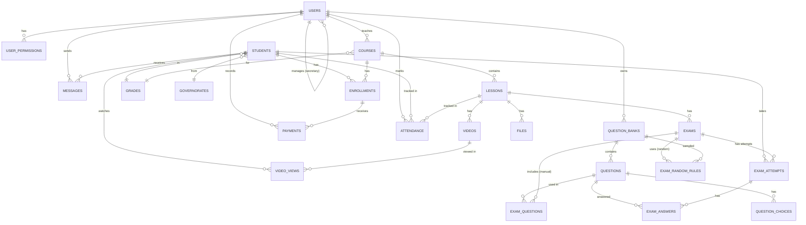
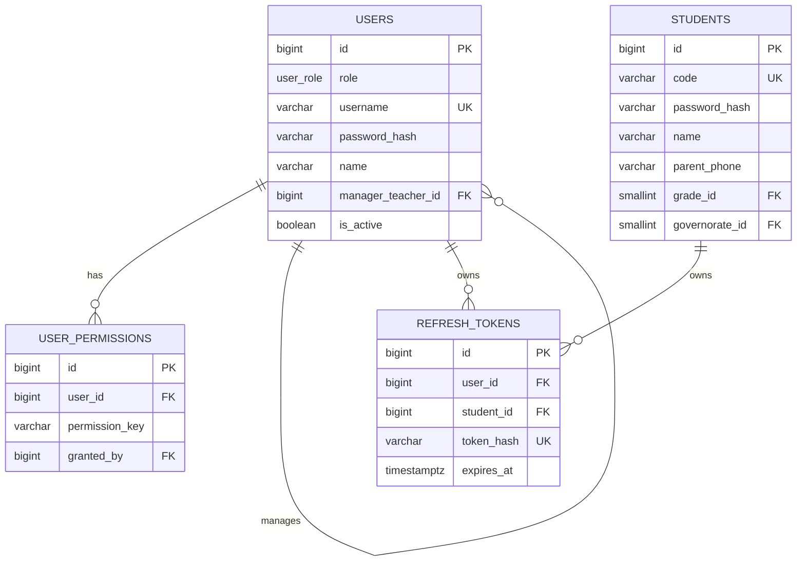
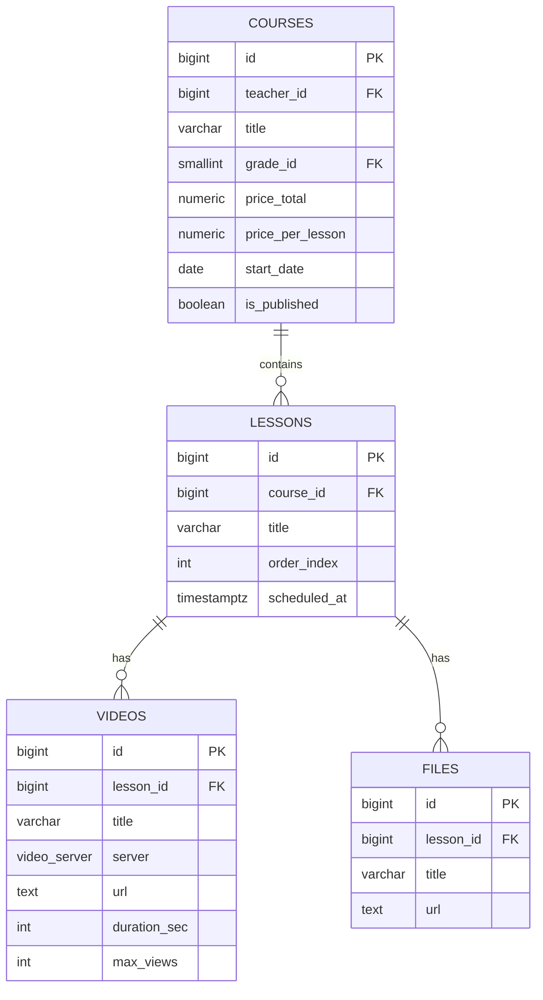
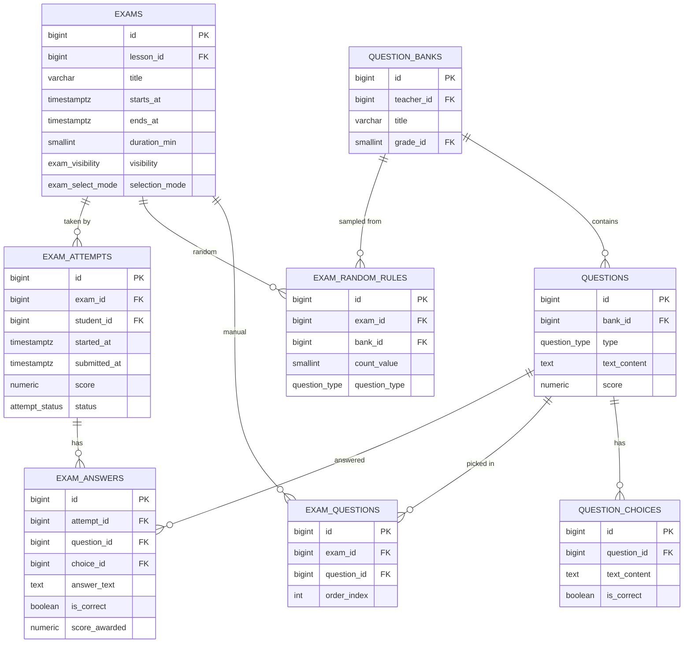
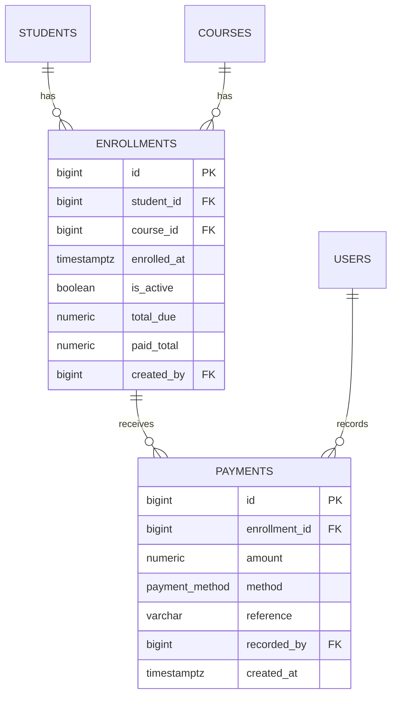
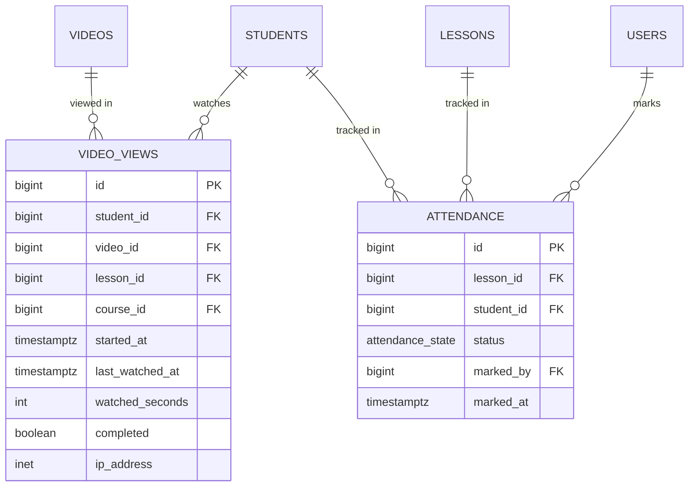

# LMS — مخطط العلاقات (ERD)

يُرسم باستخدام [Mermaid](https://mermaid.js.org/). يعمل مباشرة داخل GitHub والـ IDE الحديثة.

## 1) النظرة الكاملة

## 2) Identity & Access

## 3) المحتوى الأكاديمي

## 4) الامتحانات وبنوك الأسئلة

## 5) التسجيل والمدفوعات

## 6) التتبّع (⭐ الحضور التلقائي)

